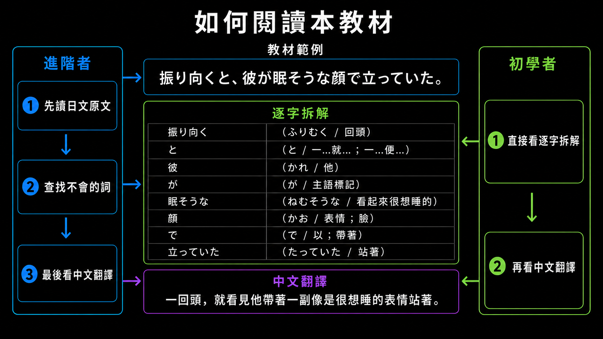

# Japanese Reading Assistant

Japanese Reading Assistant 是一個以「用小說學日文」為核心的長文本閱讀輔助工具。  
它將日文小說或文章轉換成逐字拆解格式，減少學習者反覆查單字的成本，讓初級到中級學習者也能透過有趣的原文材料持續學習。

## 教材閱讀方式

初學者可以先閱讀逐字拆解與中文翻譯；進階學習者則可以先挑戰日文原文，再針對不熟悉的詞語查看拆解與翻譯。



## 專案動機

我認為日文學習最大的困難之一，是如何長期持續接觸有興趣的內容。

小說、故事和角色對話本來是很適合長期學習的材料，因為它們比教科書例句更有情境，也更容易讓人想繼續讀下去。  
但對初級或中級學習者來說，直接閱讀日文小說的門檻很高。

最大的問題是查單字的效率太低。  
學習者常常需要一邊讀、一邊查單字、一邊猜助詞和句尾語氣，閱讀過程會被頻繁打斷。即使最後查到了單字，也不一定能理解整句話的結構和語氣。

因此我設計了 Japanese Reading Assistant。  
它會將日文長文本轉換成「原句、逐字拆解、假名、中文意思、自然翻譯」的格式，讓學習者不用一直中斷閱讀去查字典，也能看懂句子的組成。

這個專案的目標不是取代學習者思考，而是降低原文閱讀的門檻，讓初級到中級學習者也能用小說這種有趣的材料持續學日文。

## 功能

- EPUB 轉 TXT
- 清理 ruby、振假名與 HTML 標籤
- 將長文本切分成日文句子
- 每 8 句切成一個 chunk
- 合併 chunk 成 API 輸入檔
- 使用 LLM API 產生逐字拆解
- 檢查輸出格式並自動重試
- 合併多個 API 輸出檔案成完整 Markdown 文件

## 處理流程

```text
EPUB / TXT
↓
00_extract_epub_text.py
↓
01_split_paragraphs.py
↓
02_merge_chunks.py
↓
03_run_api.py
↓
04_merge_outputs.py
↓
final_output.md
```

如果一開始已經有 TXT，可以跳過 `00_extract_epub_text.py`。

## 專案結構

```text
japanese-reading-assistant/
├── README.md
├── requirements.txt
├── docs/
│   ├── 01_workflow.md
│   ├── 02_case_study.md
│   └── 03_project_faq.md
├── prompts/
│   └── word_breakdown_prompt.md
├── sample/
└── scripts/
    ├── 00_extract_epub_text.py
    ├── 01_split_paragraphs.py
    ├── 02_merge_chunks.py
    ├── 03_run_api.py
    └── 04_merge_outputs.py
```

## 使用方式

安裝套件：

```powershell
pip install -r requirements.txt
```

如果從 EPUB 開始：

```powershell
python scripts/00_extract_epub_text.py "path\to\input.epub" "sample\input_sample.txt"
python scripts/01_split_paragraphs.py
python scripts/02_merge_chunks.py
python scripts/03_run_api.py
python scripts/04_merge_outputs.py
```

如果已經有 TXT：

```powershell
python scripts/01_split_paragraphs.py
python scripts/02_merge_chunks.py
python scripts/03_run_api.py
python scripts/04_merge_outputs.py
```

執行 `scripts/03_run_api.py` 前，需要先設定 `OPENAI_API_KEY`：

PowerShell 範例：

```powershell
$env:OPENAI_API_KEY="你的 API key"
python scripts/03_run_api.py
```

執行前，請在本機終端機透過環境變數設定自己的 OpenAI API Key。請勿將實際金鑰直接貼入 `.py`、README 或其他會提交至 GitHub 的檔案。

也可以透過 `OPENAI_MODEL` 指定模型：

```powershell
$env:OPENAI_MODEL="你的模型名稱"
python scripts/03_run_api.py
```

如果未設定 `OPENAI_MODEL`，程式會使用作者開發時測試過的預設模型 `gpt-5.4-mini`。

## 技術重點

這個專案不是單純呼叫 AI 翻譯，而是設計一個可以穩定處理長文本的 pipeline。

我使用兩階段文本切分策略：

1. 先將文本切成不破壞語意的句子與小 chunk
2. 再將 chunk 合併成可追蹤的 API 輸入格式

這樣可以避免一次輸入過長造成 token 超限，也能減少句子被切斷、API 輸出格式不穩定，以及中途失敗後難以恢復的問題。

## 版權說明

公開作品集只使用自寫範例文本，不放入完整商業作品內容。

這個專案展示的是長文本處理、API 批次流程與輸出格式控制能力，而不是公開特定小說內容。
